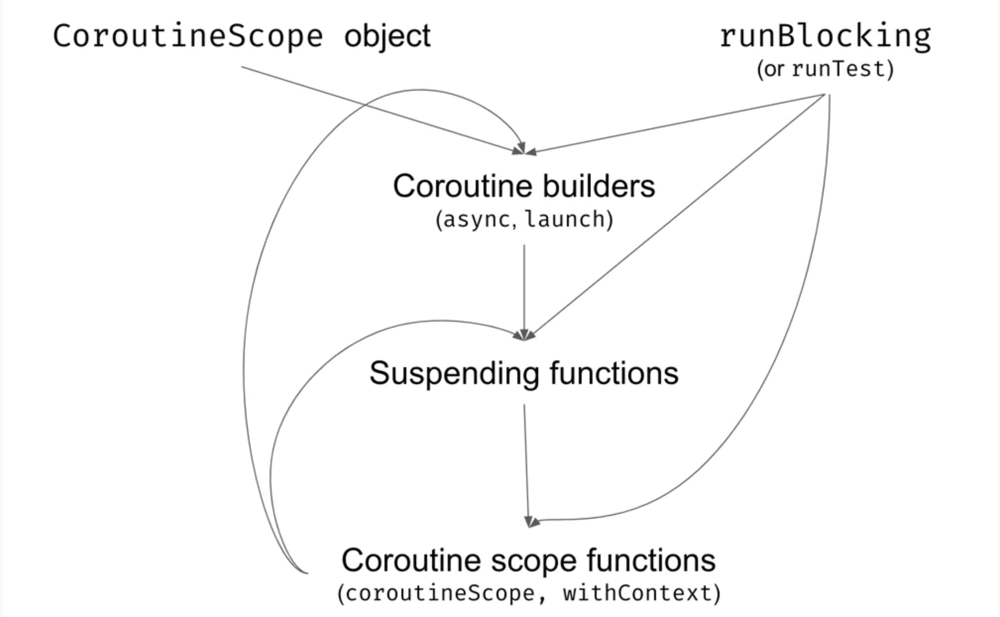

### Coroutine Builder
A suspend function needs to run within a Coroutine Scope. A Coroutine Scope is created by Coroutine Builder which is a bridge between the normal and suspending world.
  Three coroutine builders are provide by the kotlinx.coroutines library

- launch
- runBlocking
- async

### Coroutine Scope

Encapsulates a Coroutine Context used by Coroutine Builders

### Coroutine Context

Every coroutine has a context. CoroutineContext is a universal way to group and pass objects to coroutines. 
Objects like the Dispatchers, Coroutine Name and linked list the chain of coroutines the coroutine is a part of  

### Job

A Job instance in the coroutineContext represents the coroutine itself. Is returned by a Coroutine Builder.

[comment]:<>(TODO describe each element)

Notes:
- the compiler converts a suspend function into state machine and add an additional continuation parameter
- the compiler identifies suspension within the suspend function
-  https://medium.com/androiddevelopers/the-suspend-modifier-under-the-hood-b7ce46af624f